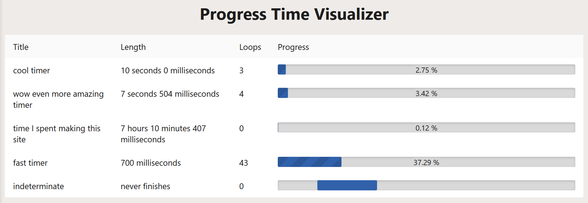

# Time Visualizer

A Leptos progress visualizer!

## Usage

Add query parameters in the format of `title=milliseconds_or_message` to add a progress bar. If the value is a number, into will make a progress bar lasting that many milliseconds. Otherwise, it will be the message for an indeterminate progress bar

Example: https://progress-visualizer.netlify.app/?cool%20timer=10000&wow%20even%20more%20amazing%20timer=7504&time%20I%20spent%20making%20this%20site=25800407&fast%20timer=700&indeterminate=never%20finishes

## Commands

`just --list`

## Challenges

I ran into issues with `setInterval`'s accuracy. I switched to using time elapsed to calculate the percentage finished on an interval instead. There was no `Instant` implementation for `wasm32-unknown-unknown`, so I installed the `instant` crate with the `wasm-bindgen` flag

`leptonic` and `cookie` wanted different versions of `time`. I could not resolve the issue by updating this package's dependencies, so I forked Leptonic to update the `leptos-use` and `time` crates, which worked great!
